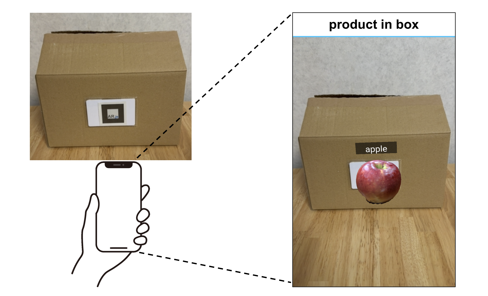

# rfid-storage-ar-visualizer

## システムの概要
RFIDタグ付き商品を箱の中に入れると，スマートフォンのwebアプリ上で内容物が箱の中にあるように重畳表示されます．



## フォルダ構成
```
rfid-storage-ar-visualizer/
├── rfid/
│ ├── rfid-read.py # タグの商品IDを読み取る
│ └── rfid-write.py # タグに商品IDを書き込む
├── webapp/
│ ├── instance/ # database
│ ├── static/ # 3Dモデルとマーカー情報
│ ├── templates/ # html
│ └── app.py # webアプリの起動ファイル
```

## 機能
- **RFID タグによる物品識別** — 箱内のMFRC522リーダーがRFIDタグを読み取り、収納物を自動認識
- **3D モデルの AR 表示** — AR.js を用いて、ARマーカー上に物品の3Dモデルをブラウザ上で表示
- **リアルタイム更新** — SocketIO による双方向通信で、箱の中身が変わると即座に表示が切り替わる
- **3D スキャンモデル対応** — Scaniverse アプリで実物をスキャンした GLB モデルを使用
